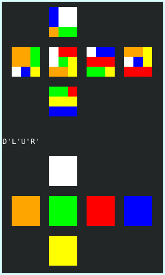

# cli-rubiks-cube



> Um simples simulador de cubo mágico direto no terminal!

## 🚀 Instalando cli-rubiks-cube

Para instalar o programa, basta clonar o repositório e compilar com:

```
make
```
(É preciso já ter o compilador gcc instalado)

## 🧊 Usando cli-rubiks-cube

Execute o programa com:

```
./scramble
```
E insira as instruções desejadas usando [notação de movimentos](https://jperm.net/3x3/moves).

Veja a seguir alguns exemplos de instruções válidas:
```
x R2 F R F' R U2 r' U r U2
```
```
RU'R'U'RURDR'U'RD'R'U2R'
```
```
M' U M2 U M2 U M' U2' M2
```
```
Y2 Rw' F R U M' U' R' F' R X'
```
```
R UFLDBrufld bMES2xyz'2
```
O estado atual do cubo é imprimido a cada passo das instruções.

Conjuntos de movimentos sem espaço entre eles são executados em um único passo.

Saia do programa com `Ctrl + D`.

[⬆ Voltar ao topo](#cli-rubiks-cube)<br>